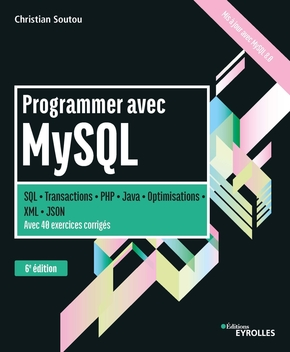
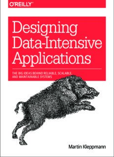
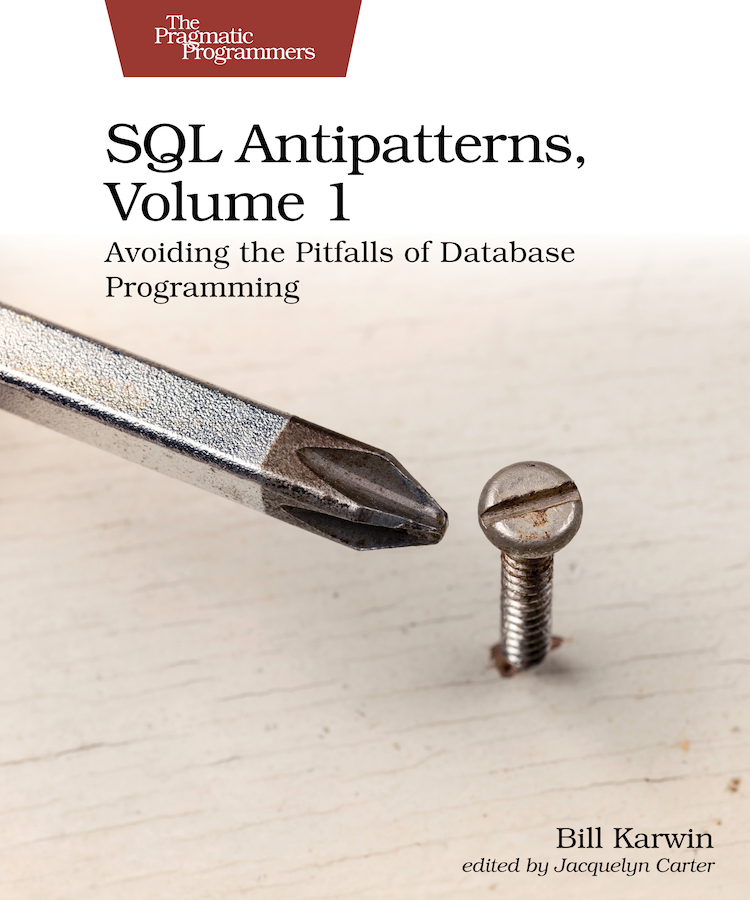

# sql-b3

L'ensemble des sources SQL du module B3 Dev SQL, avec MySQL

- [sql-b3](#sql-b3)
  - [Module 2 - Introduction aux SGBDs](#module-2---introduction-aux-sgbds)
  - [Module 3 - Premiers pas avec MySQL](#module-3---premiers-pas-avec-mysql)
  - [Module 4 - Modélisation d'une base de données](#module-4---modélisation-dune-base-de-données)
  - [Module 5 - Opérateurs, jointures et fonctions d'ensemble](#module-5---opérateurs-jointures-et-fonctions-densemble)
  - [Module 6 - Niveau externe : vues, déclencheurs, fonctions et procédures stockées](#module-6---niveau-externe--vues-déclencheurs-fonctions-et-procédures-stockées)
  - [Module 7 - Transactions et aller plus loin](#module-7---transactions-et-aller-plus-loin)
  - [Références (aller plus loin)](#références-aller-plus-loin)
    - [Ouvrages](#ouvrages)
    - [Sur le web](#sur-le-web)

## Module 2 - Introduction aux SGBDs

[Voir toutes les ressources du module 2](./module-02/)

- [Voir démo "La base de données la plus simple du monde"](./module-02/atelier-base-de-donnees-simple/)

## Module 3 - Premiers pas avec MySQL

[Voir toutes les ressources du module 3](./module-03/)

- [Voir correction et commentaire du TD "Premiers pas avec MySQL"](./module-03/td-premiers-pas-avec-mysql-corrige-commente.md)
- [Accéder à la démo des opérations définies par l'algèbre relationnelle](./module-03/demo-algebre-relationnelle/)
- [Voir correction commentée de la fiche d'exercices (Exercices 1, 2 et 3)](./module-03/exercices/)
- [Voir la démo atomicity](./module-03/demo-atomicity/)

## Module 4 - Modélisation d'une base de données

- [Accéder aux exercices et correction](./module-04/)

## Module 5 - Opérateurs, jointures et fonctions d'ensemble

- [Accéder aux exercices et correction](./module-05/exercices/)
- [Accéder au TD et à sa correction](./module-05/td/)

## Module 6 - Niveau externe : vues, déclencheurs, fonctions et procédures stockées

- [Accéder à la démo sur les triggers](./module-06/demo-trigger/)
- [Accéder à la démo vue et triggers sur un petit système de site web éditorial](./module-06/demo-vues/)
- [Accéder aux exercices](./module-06/exercices.md)

## Module 7 - Transactions et aller plus loin

À venir...

## Références (aller plus loin)

### Ouvrages

- [Modélisation des bases de données: UML et les modèles entité-association, 4e édition ou 5e édition](https://www.eyrolles.com/Informatique/Livre/modelisation-des-bases-de-donnees-9782416007507/), de Christian Soutou et Frédéric Brouard, 2022 (pour la 5e). Une très bonne référence sur la modélisation des bases de données relationnelles, du modèle conceptuel au niveau physique. Très complet, plein de conseils, et d'exercices inspirés de cas réels. Ces deux auteurs ont souvent travaillé ensemble et le résultat est là (théorie, pratique, expertise en milieu pro). Un *must have*. (Pas fait pour les débutants sur le modèle relationnel, à étudier/parcourir après avoir acquis les bases et pratiquer un peu)
- [Designing data intensive applications](https://www.pdfdrive.com/designing-data-intensive-applications-the-big-ideas-behind-reliable-scalable-and-maintainable-systems-e167514656.html), de Martin Kleppmann, 2017, publié par O'Reilly, une référence absolue sur les systèmes d'informations et sur les SGBD
- [High Performance MySQL, 3rd Edition](https://learning.oreilly.com/library/view/high-performance-mysql/9781449332471/), de Schwartz, Zaitsev et Tkachenko, 2012, publié par O'Reilly
- [Programmer avec MySQL: SQL - Transactions - PHP - Java - Optimisations - XML - JSON - Avec 40 exercices corrigés, 6eme édition](https://www.eyrolles.com/Informatique/Livre/programmer-avec-mysql-9782416003684/), de Christian Soutou, 2021, par Eyrolles. Très bon livre et complet sur le modèle relationnel et le SGBD MySQL, avec beaucoup d'exercices corrigés. Bon ouvrage pour débutants (et confirmés) pour apprendre les bases.
- [SQL Antipatterns, Volume 1 : Avoiding the pitfalls of Database Programming](https://pragprog.com/titles/bksap1/sql-antipatterns-volume-1/), de Bill Karwin, publié chez Pragmatic Bookshelf, . Étudier et éviter les anti patterns pour écrire de meilleures requêtes SQL.

### Sur le web

- [Cours complet pour apprendre les systèmes de gestion de bases de données](https://sgbd.developpez.com/tutoriels/cours-complet-bases-de-donnees/), un cours complet de [Georges Gardarin](https://www.eyrolles.com/Accueil/Auteur/georges-gardarin-34/) sur les bases relationnelles
- [Les meilleurs cours et tutoriels pour apprendre le SQL](https://sql.developpez.com/), par les membres de developpez.com. Un grand nombre de cours, tutoriels, exercices sur le sujet
- Une [sélection de livres](https://sgbd.developpez.com/livres/) par les membres de developpez.com
- Aller sur d'autres implémentations du standard ([MariaDB](https://mariadb.org/), [PostgreSQL](https://www.postgresql.org/), etc.)
- Aller plus loin sur les questions d'optimisation ? Lire des articles sur le site [Use the index, Luke !](https://use-the-index-luke.com/fr), de Markus Winand
- [Base de données, cours de E. Thirion](http://cours.thirion.free.fr/Cours/BaseDeDonnees1/index.php), les cours de E. Thirion sur MySQL. E. Thirion est un chercheur et enseignant en informatique depuis des années et a développé un site pour réunir et partager ses cours sur tout un tas de sujets liés au développement informatique (bases de la programmation, POO, UI, développement web, [bases de données relationnelles](http://cours.thirion.free.fr/Cours/BaseDeDonnees1/index.php), [Merise](http://cours.thirion.free.fr/Cours/Merise/index.php), etc.). Et on l'en remercie.