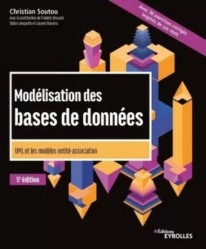

# sql-b3

L'ensemble des sources SQL du module B3 Dev SQL, avec MySQL

- [sql-b3](#sql-b3)
  - [Module 2 - Introduction aux SGBDs](#module-2---introduction-aux-sgbds)
  - [Module 3 - Premiers pas avec MySQL](#module-3---premiers-pas-avec-mysql)
  - [Références (aller plus loin)](#références-aller-plus-loin)

## Module 2 - Introduction aux SGBDs

[Voir toutes les ressources du module 2](./module-02/)

- [Voir démo "La base de données la plus simple du monde"](./module-01/)

## Module 3 - Premiers pas avec MySQL

[Voir toutes les ressources du module 3](./module-03/)

- [Voir correction et commentaire du TD "Premiers pas avec MySQL"](./module-03/td-premiers-pas-avec-mysql-corrige-commente.md)
- [Accéder à la démo des opérations définies par l'algèbre relationnelle](./module-03/demo-algebre-relationnelle/)

## Références (aller plus loin)

- [Cours complet pour apprendre les systèmes de gestion de bases de données](https://sgbd.developpez.com/tutoriels/cours-complet-bases-de-donnees/), un cours complet de [Georges Gardarin](https://www.eyrolles.com/Accueil/Auteur/georges-gardarin-34/) sur les bases relationnelles
- [Les meilleurs cours et tutoriels pour apprendre le SQL](https://sql.developpez.com/), par les membres de developpez.com. Un grand nombre de cours, tutoriels, exercices sur le sujet
- Une [sélection de livres](https://sgbd.developpez.com/livres/) par les membres de developpez.com
- Aller sur d'autres implémentations du standard ([MariaDB](https://mariadb.org/), [PostgreSQL](https://www.postgresql.org/), etc.)
- Aller plus loin sur les questions d'optimisation ? Lire des articles sur le site [Use the index, Luke !](https://use-the-index-luke.com/fr), de Markus Winand