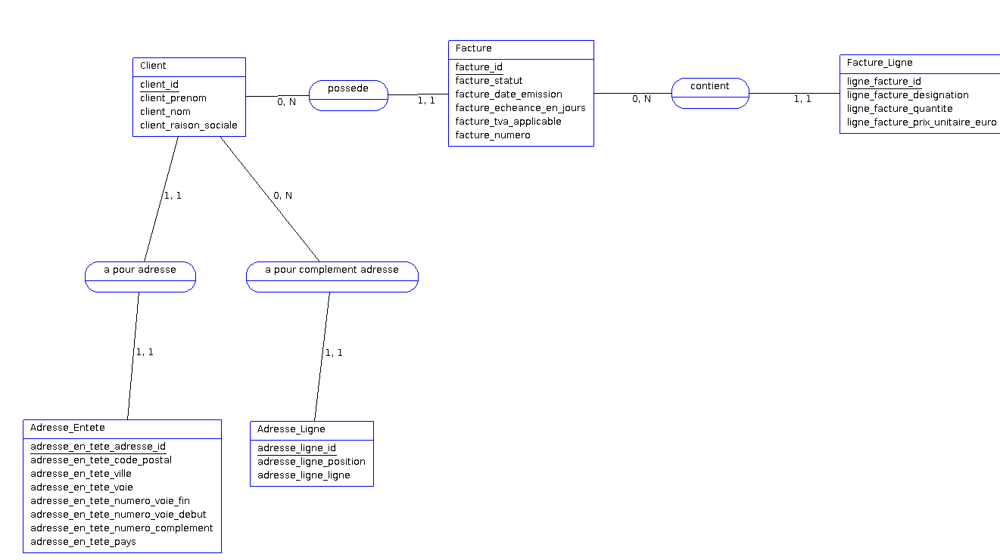

# Correction exercices - Module 4: Modélisation

version: 2

# Exercice 1

Remarques:

- Il est préférable d'utiliser *deux associations* pour modéliser une rencontre entre 2 équipes qu'une seule association plusieurs à plusieurs (*many-to-many*). Cela permet de passer plus facilement du modèle conceptuel ou modèle relationnel. Ici l'entité `Match` est une *classe-association* (ou *table relationnelle* dans la couche relationnelle)
- Il est préférable de relier `Stade` à `Ville` plutôt que `Match` à `Ville`. Cette information est déduite sans ambiguïté des associations `dérouler` et `est un lieu de`.

## Exercice 2

1. Le diagramme UML avec les associations

2. Passage du modèle conceptuel (diagramme de classes UML) au modèle relationnel.
   1. Une classe => une relation
   2. Chaque relation doit avoir une clé primaire (clé système) => attribut `id INTEGER`
   3. Association *un à plusieurs* => contraintes de **clé étrangère** du côté `plusieurs` (donc la relation Facture)
   4. Types:
      1. String => VARCHAR
      2. Date => DATE (ou TIMESTAMP)
      3. Currency => DECIMAL (le type `DECIMAL` [enregistre des valeurs exactes](https://dev.mysql.com/doc/refman/8.0/en/fixed-point-types.html)). Ici on va mettre `DECIMAL(7,2)`, ce qui nous permet d'aller de -99999,99 à 99999,99 EUROS

Ce qui donne

3. À présent qu'on a un modèle relationnel satisfaisant, on peut passer à son implémentation en SQL (qu'on appelle *modèle physique* des données). Voici le contenu du script `ddl_modelisation.sql` pour créer les relations. 

~~~SQL
USE modelisation;

CREATE TABLE IF NOT EXISTS Client(
    id_client INTEGER PRIMARY KEY,
    nom_client VARCHAR(40) NOT NULL,
    prenom_client VARCHAR(30) NOT NULL
);

CREATE TABLE IF NOT EXISTS Facture(
    id_facture INTEGER PRIMARY KEY,
    id_client INTEGER,
    num_facture VARCHAR(10),
    date_emission DATE,
    montant_euro DECIMAL(7,2),
    paye BOOLEAN DEFAULT false COMMENT 'Par défaut: impayé',
    CONSTRAINT fk_client_possede_facture FOREIGN KEY(id_client) REFERENCES Client(id_client) 
);

-- Décrire les tables (DESC est l'abréviation de DESCRIBE)
DESC Client;
DESC Facture;
~~~

4. Pour insérer les données, on peut au choix :
   1. Insérer le client *avant* ses factures (a cause de la contrainte FK);
   2. Insérer les clients et les factures dans n'importe quel ordre et ajouter les contraintes `FOREIGN KEY` *après* avec l'instruction `ALTER TABLE Client ADD CONSTRAINT`.

On va choisir l'option 1. Ici, on va créer les id manuellement et non en utilisant `AUTO_INCREMENT`. Si on laissait le SGBD gérer la génération séquentielle des id on pourrait utiliser dans le script la fonction MySQL `LAST_INSERT_ID()` pour récupérer le dernier id généré.

~~~SQL
-- Créer la base de données avec l'user root et donnez tous les privilèges dessus à l'user dev:
-- CREATE DATABASE modelisation;
-- GRANT ALL PRIVILEGES ON modelisation.* TO 'dev'@'localhost';

USE modelisation;

-- inline constraint (attention, primary key ne fait pas AUTO_INCREMENT par défaut)
-- On peut ajouter ici un AUTO_INCREMENT
CREATE TABLE IF NOT EXISTS Client(
    id_client INTEGER PRIMARY KEY, 
    nom_client VARCHAR(40) NOT NULL,
    prenom_client VARCHAR(30) NOT NULL
);

CREATE TABLE IF NOT EXISTS Facture(
    id_facture INTEGER PRIMARY KEY,
    id_client INTEGER,
    num_facture VARCHAR(10),
    date_emission DATE,
    -- Remarque : les données monétaires devraient être persistées sur des valeurs entieres en centimes
    -- Ici on utilise le decimal pour l'exercice (cf les remarques faites en cours)
    montant_euro DECIMAL(7, 2),
    paye BOOLEAN DEFAULT false COMMENT 'Par défaut: impayé',
    CONSTRAINT fk_client_possede_facture FOREIGN KEY(id_client) REFERENCES Client(id_client)
);

-- Décrire les tables (DESC est l'abréviation de DESCRIBE)
-- DESC Client;
-- DESC Facture;

-- Insertion des données

-- INSERT INGORE permet d'ignorer les insert qui échoue (ex: contrainte violée sur PK car la donnée a déjà été insérée) et de continuer la requête malgré les erreurs (pratique pour debug).

-- Comme pas d'AUTO_INCREMENT sur la clef primaire, on doit l'insérer manuellement
INSERT IGNORE INTO
    Client (id_client, nom_client, prenom_client)
VALUES
    (1, 'John', 'Doe'),
    (2, 'Jane', 'Doe');

-- DATE attend les dates au format YYYY-MM-DD

-- Comme pas d'AUTO_INCREMENT sur la clef primaire, on doit l'insérer manuellement
INSERT IGNORE INTO 
    Facture (
        id_facture,
        id_client,
        num_facture,
        date_emission,
        montant_euro,
        paye
    )
    VALUES
    (1, 1, 'F-900-08', '2022-12-12', 120.5, FALSE),
    (2, 1, 'F-500-02', '2023-13-01', 90, TRUE),
    (3, 2, 'Z-500-03', '2023-01-01', 1000, FALSE),
    (4, 2, 'J-400-02', '2023-09-11', 800, TRUE),
    (5, 2, 'F-434-04', '2023-12-22', 400, FALSE);
    (6, 2, 'J-333-05', '2023-02-07', 1255, FALSE);
~~~

5. Voici les requêtes (DQL) pour récupérer les résultats attendus

~~~SQL
-- 1. Lister toutes les factures impayées
SELECT * FROM Facture WHERE paye;

-- 2. Lister tous les numéros de facture impayée dont le montant est supérieur à 500 EUROS
SELECT num_facture FROM Facture WHERE NOT paye AND montant_euro > 500;

-- 3. Lister toutes les factures de 2022
SELECT num_facture FROM Facture WHERE YEAR(date_emission) = 2022;

-- 4. Lister toutes les factures impayées de 2023 
SELECT num_facture FROM Facture WHERE YEAR(date_emission) = 2023 AND NOT paye;

~~~

## Exercice 3

[Voir les scripts et le projet AnalyseSI](./exercice-3-analyseSI-v2/)

1. AnalyseSI peut rencontrer des problèmes avec les associations 1-1 car il place les clefs sur chaque relation de l'association. Il suffit de supprimer les colonnes `adresse_en_tete_id` et `adresse_ligne_id` de la relation `Adresse` et les contraintes FK correspondantes (voir code sql commenté).
2. `TRUNCATE` ne fonctionne pas ici `TRUNCATE` ne provoque pas le ON DELETE Trigger, donc notre politique de ne peut être appliquée. `TRUNCATE` refuse de détruire la table si référence vers FK Citation de la doc : *"The `TRUNCATE` TABLE statement does not invoke `ON DELETE` triggers. `TRUNCATE TABLE` fails for an InnoDB table if there are any `FOREIGN KEY` constraints from other tables that reference the table. Foreign key constraints between columns of the same table are permitted."* Utiliser `DELETE FROM` à la place, qui supprimera chaque ligne individuellement sans toucher à la structure de la table.
3. -
4. -
5. -
6. -
7. Il est impossible de supprimer un client en l'état car il est référencé par un enregistrement facture, via la contrainte de clef étrangère. Supprimer un client dans ces conditions briserait la cohérence des données. Pour le faire, on maintient la cohérence de la base en ajoutant une politique `ON DELETE CASCADE` (par défaut en mode `STRICT`) sur la clé étrangère de Facture vers Client et de LigneFacture vers Facture.
8. Oui ! il est possible de définir des contraintes `CHECK` *à l'échelle de la table* également. Dans ce cas, on peut référencer plusieurs colonnes dans la contrainte :

~~~SQL
-- Ajout des contraintes sur les lignes avec une contrainte CHECK (contraintes 9 et 10 de l'énoncé)
ALTER TABLE Adresse_Entete 
ADD CONSTRAINT ck_voie 
CHECK 
(LENGTH(adresse_en_tete_numero_voie_debut) + LENGTH(adresse_en_tete_numero_voie_fin) + LENGTH(adresse_en_tete_numero_complement) + LENGTH(adresse_en_tete_voie) <= 38);

ALTER TABLE Adresse_Entete 
ADD CONSTRAINT ck_ville_code_postal 
CHECK 
(LENGTH(adresse_en_tete_code_postal) + LENGTH(adresse_en_tete_ville) <= 38);

-- Prérequis : On suppose que le client avec un id=1 est présent en base

-- Adresse qui ne respecte pas le standard sur la ligne de la voie
INSERT INTO Adresse_Entete(client_id, adresse_en_tete_code_postal, adresse_en_tete_ville, adresse_en_tete_voie, adresse_en_tete_numero_voie_debut , adresse_en_tete_numero_voie_fin, adresse_en_tete_numero_complement, adresse_en_tete_pays) VALUES (1, '75001', 'Paris', "Rue de l'Ambiance Spectaculaire", 123, 124, 'Bis', 'France');

-- Adresse qui respecte le standard
INSERT INTO Adresse_Entete(client_id, adresse_en_tete_code_postal, adresse_en_tete_ville, adresse_en_tete_voie, adresse_en_tete_numero_voie_debut , adresse_en_tete_numero_voie_fin, adresse_en_tete_numero_complement, adresse_en_tete_pays) VALUES (1, '75001', 'Paris', 'Rue de la paix', 123, 124, 'Bis', 'France');
~~~

<!-- [Voir solution avec mysqlworkbench](./exercice3-mysqlworkbench/schema.sql) -->

### Questions supplémentaires

1. Ici il va falloir faire une jointure sur les 3 tables `Client`, `Facture` et `Facture_Ligne` pour répondre à la question

~~~SQL
-- Récupère la facture complète (avec toutes les lignes) d'un client
SELECT * 
FROM Facture f 
INNER JOIN Client c ON c.client_id=f.client_id 
INNER JOIN Facture_Ligne fl ON fl.facture_id=f.facture_id 
WHERE c.client_id=1  AND f.facture_id=1;
~~~

~~~SQL
-- Calcule montant total HT et TTC de la facture du client 1 (avec TVA)
SELECT 
SUM(ligne_facture_prix_unitaire_euro * ligne_facture_quantite) as 'Montant Total HT (EUROS)', 
IF(facture_tva_applicable , SUM(ligne_facture_prix_unitaire_euro * ligne_facture_quantite) * 1.2, SUM(ligne_facture_prix_unitaire_euro * ligne_facture_quantite)) as 'Montant Total TTC (EUROS)'
FROM Facture f  
INNER JOIN Client c ON c.client_id=f.client_id 
INNER JOIN Facture_Ligne fl ON fl.facture_id=f.facture_id 
WHERE c.client_id=1 AND  f.facture_id=1;
~~~

~~~SQL
-- Calcule montant total HT et TTC de la facture du client 2 (sans TVA)
SELECT 
SUM(ligne_facture_prix_unitaire_euro * ligne_facture_quantite) as 'Montant Total HT (EUROS)', IF(facture_tva_applicable , SUM(ligne_facture_prix_unitaire_euro * ligne_facture_quantite)*1.2, SUM(ligne_facture_prix_unitaire_euro * ligne_facture_quantite)) as 'Montant Total TTC (EUROS)'
FROM Facture f 
INNER JOIN Client c ON c.client_id=f.client_id 
INNER JOIN Facture_Ligne fl ON fl.facture_id=f.facture_id  
WHERE c.client_id=2 AND f.facture_id=2;
~~~

2. Ici il va falloir joindre les tables `Client`, `Adresse`, `Adresse_Entete` et `Adresse_Ligne` et créer un agrégat avec `GROUP BY` et `GROUP_CONCAT` pour les lignes optionnelles :
~~~SQL
-- Fabrique le nom complet du Destinataire
SELECT CONCAT_WS(' ',client_prenom, client_nom, client_raison_sociale) FROM Client c;
~~~

~~~SQL
-- Regrouper les lignes optionnelles de l'adresse dans le bon ordre
SELECT GROUP_CONCAT(adresse_ligne_ligne ORDER BY adresse_ligne_position SEPARATOR ' ') AS "Adresse Lignes Optionnelles" 
FROM  Adresse_Ligne
GROUP BY client_id;
~~~

~~~SQL
-- Retourne l'adresse complète sur une ligne dans le bon ordre (format Francais) pour chaque client
SELECT TRIM(CONCAT_WS(' ',client_prenom, client_nom, client_raison_sociale)) AS 'Destinataire', 
TRIM(CONCAT_WS(' ', adresse_en_tete_code_postal, adresse_en_tete_ville, CONCAT_WS('-',adresse_en_tete_numero_voie_debut,adresse_en_tete_numero_voie_fin), adresse_en_tete_numero_complement, adresse_en_tete_voie, GROUP_CONCAT(adresse_ligne_ligne ORDER BY adresse_ligne_position SEPARATOR ' '), adresse_en_tete_code_postal , adresse_en_tete_ville )) AS 'Adresse'  
FROM Client c 
INNER JOIN Adresse_Entete ae ON c.client_id=ae.client_id 
LEFT JOIN Adresse_Ligne al ON al.client_id=ae.client_id 
GROUP BY c.client_id;
~~~

3. À venir (ou me le rappeler par e-mail).

## Exercice 6

<!-- Également en Biblio -->

[Télécharger le corrigé Original](https://www.orleans-informatique.com/info/sio/exercices/TD%20N%C2%B04%20-%20MERISE%202%20-%20SQL%20-%20corrig%C3%A9.pdf) proposé par J. Paquereau (BTS SIO)